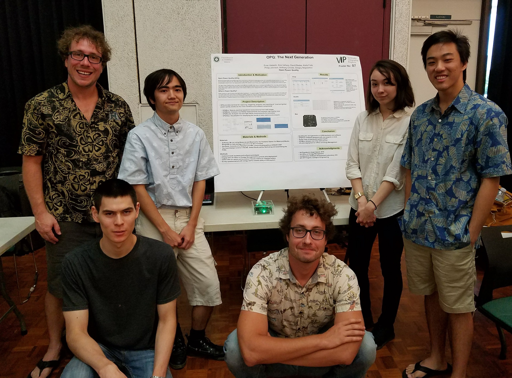

The Open Power Quality Project presented at the Spring 2018 "Vertically Integrated Projects showcase" at the University of Hawaii. Pictured standing from left to right: Anthony Christe, Kea Uehara, Kaila Foltz, and Evan Hataishi.  Kneeling: David Badke, Serge Negrashov.

 

 
