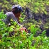

For his work on Open Power Quality, ICS Ph.D. student Sergey Negrashov is the 2018 recipient of the Martin Award for Information and Computer Science from the [ARCS Foundation--Honolulu](https://honolulu.arcsfoundation.org/).  We are very proud of Sergey! 

 

 
