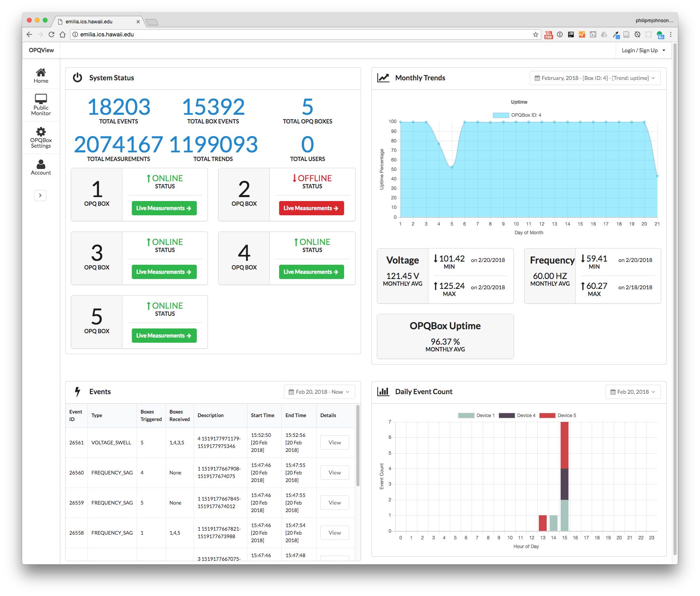

# Develop your React UI skills with Open Power Quality

Based upon [NPM Download statistics](https://npmcharts.com/compare/react,angular,@angular/core,ember-cli,vue), the [React Framework](https://reactjs.org/) is on its way to becoming the most popular front end for application development. 

If you are interested in developing your React user interface development skills, then you might consider joining the Open Power Quality project!

Our current user interface, called OPQView, is based on [Semantic UI](https://semantic-ui.com/) and [Meteor](https://www.meteor.com/) and looks like this:

We are currently reimplementing OPQView with React to improve its usability and capabilities. We've identified over a dozen React components that need implementation: check out the React Backlog column of the [OPQ M1 Project Board](https://github.com/openpowerquality/opq/projects/1) for a listing of the components. 

We currently have three people working on the React redesign of OPQView, and we could use a few more. 

Here are the prerequisites:

  * Time commitment of at least 6 hours a week for at least three months. (Independent study credits are possible.)
  * Ability to attend one weekly meeting. (Currently Wednesdays at 2pm, but we can adjust.)
  
You must also be interested in developing the following skills:
  * [Modern Javascript](http://es6-features.org/).
  * [IntelliJ IDEA/WebStorm](https://www.jetbrains.com/idea/) and [ESLint](https://eslint.org/) based development 
  * [GitHub](https://github.com) project management (each issue in a branch, merge to/from master as necessary).
  * [Meteor web application framework](http://meteor.com) development.
  * [Semantic UI React Framework](https://react.semantic-ui.com/) user interface development.
  
This project is a gateway into many fascinating research and development issues involving: power quality, renewable energy, internet of things, hardware-software codesign, big data analytics, machine learning, and more!

If you're interested, please contact Philip Johnson (johnson@hawaii.edu).
